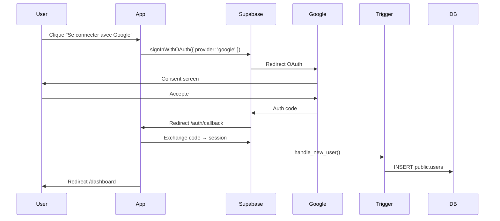

# 🔒 Guide de Sécurité - AFNEUS Remboursement

## 📋 Table des Matières

1. [Architecture Sécurisée](#architecture)
2. [Authentification & Sessions](#auth)
3. [Protection CSRF](#csrf)
4. [Row Level Security (RLS)](#rls)
5. [Gestion des Secrets](#secrets)
6. [Cookies Sécurisés](#cookies)
7. [Headers de Sécurité](#headers)
8. [Procédures d'Urgence](#emergency)
9. [Monitoring & Audit](#monitoring)
10. [Checklist Production](#checklist)

---

## 🏗️ Architecture Sécurisée {#architecture}

### Séparation Client/Serveur

```
┌─────────────────┐
│   Browser       │
│  (Client-side)  │
│                 │
│  ✅ supabase    │  ← Anon key (public)
│  ❌ supabaseAdmin│  ← INTERDIT !
└─────────────────┘
        │
        │ HTTPS only
        │
┌─────────────────┐
│  API Routes     │
│ (Server-side)   │
│                 │
│  ✅ supabase    │  ← Anon key (avec session user)
│  ✅ supabaseAdmin│  ← Service role (admin ops)
└─────────────────┘
        │
        │ TLS
        │
┌─────────────────┐
│   Supabase      │
│   PostgreSQL    │
│                 │
│  🔒 RLS actif   │
└─────────────────┘
```

### Règles d'Or

- ✅ **JAMAIS** exposer `SUPABASE_SERVICE_ROLE_KEY` côté client
- ✅ **TOUJOURS** utiliser RLS (Row Level Security)
- ✅ **TOUJOURS** valider les données côté serveur (Zod)
- ✅ **TOUJOURS** logger les actions sensibles (audit_logs)

---

## 🔐 Authentification & Sessions {#auth}

### Configuration Supabase Auth

**Dashboard → Authentication → Settings**

```yaml
Access Token Lifetime: 15 minutes (900 seconds)
Refresh Token Lifetime: 30 days
Refresh Token Rotation: Enabled
Session TTL: 12 hours
```

### Timeouts de Session

Le middleware Next.js implémente 3 niveaux de protection:

1. **Idle Timeout**: 30 minutes d'inactivité → logout automatique
2. **Absolute Timeout**: 12 heures max → logout forcé
3. **Device Binding**: Changement UA/IP → logout sécurité

```typescript
// Configuration dans middleware.enhanced.ts
const IDLE_TIMEOUT_MS = 30 * 60 * 1000;        // 30 min
const ABSOLUTE_TIMEOUT_MS = 12 * 60 * 60 * 1000; // 12h
```

### Flow OAuth Google



---

## 🛡️ Protection CSRF {#csrf}

### Double-Submit Cookie Pattern

1. **Génération** (server):
   - Créer token aléatoire (32 bytes hex)
   - Hasher avec SHA-256
   - Stocker hash dans cookie `__Host-csrf-token`
   - Retourner token brut dans header `X-CSRF-Token`

2. **Vérification** (server):
   - Récupérer hash depuis cookie
   - Récupérer token brut depuis header `X-CSRF-Token`
   - Hasher token brut
   - Comparer les hashes

3. **Usage Client**:
   ```typescript
   import { useCsrfToken, secureFetch } from '@/lib/hooks/useCsrfToken';

   const csrfToken = useCsrfToken();

   await secureFetch('/api/claims/create', {
     method: 'POST',
     body: JSON.stringify(data),
   }, csrfToken);
   ```

### Endpoints Protégés

Tous les `POST`, `PUT`, `PATCH`, `DELETE` sous `/api/*` nécessitent un token CSRF valide.

Exceptions:
- `/api/healthz` (GET only)
- `/api/csrf` (génération token)

---

## 🔒 Row Level Security (RLS) {#rls}

### Tables Protégées

| Table | RLS | Policies |
|-------|-----|----------|
| `users` | ✅ | 5 policies |
| `events` | ✅ | 6 policies |
| `event_baremes` | ✅ | 2 policies |
| `expense_claims` | ✅ | 9 policies |
| `expense_items` | ✅ | 9 policies |
| `audit_logs` | ✅ | 1 policy |

### Policies par Rôle

#### MEMBER (utilisateur normal)
- ✅ Lire ses propres demandes
- ✅ Créer une demande
- ✅ Modifier ses demandes DRAFT
- ❌ Voir les demandes des autres
- ❌ Changer les statuts

#### VALIDATOR
- ✅ Lire toutes les demandes
- ✅ Changer statut (DRAFT → TO_VALIDATE → VALIDATED/REJECTED)
- ❌ Marquer comme PAID
- ❌ Supprimer

#### TREASURER
- ✅ Lire toutes les demandes
- ✅ Modifier toutes les demandes
- ✅ Marquer comme PAID
- ✅ Exporter SEPA
- ❌ Supprimer (sauf admin)

#### ADMIN
- ✅ **TOUT** (bypass RLS si service role)
- ✅ Gérer les rôles
- ✅ Supprimer
- ✅ Accès audit logs

### Tester les Policies

```sql
-- Test 1: User normal ne voit QUE ses demandes
SET LOCAL ROLE authenticated;
SET LOCAL request.jwt.claim.sub = '<user_uuid>';
SELECT * FROM expense_claims;
-- Devrait retourner UNIQUEMENT les claims de cet user

-- Test 2: Anon ne voit RIEN
SET LOCAL ROLE anon;
SELECT * FROM expense_claims;
-- Devrait retourner 0 lignes

-- Test 3: Validator voit TOUT
SET LOCAL ROLE authenticated;
SET LOCAL request.jwt.claim.sub = '<validator_uuid>';
SELECT * FROM expense_claims;
-- Devrait retourner TOUTES les claims
```

---

## 🔑 Gestion des Secrets {#secrets}

### Variables d'Environnement

**Fichier:** `.env.local` (JAMAIS committé !)

```bash
# ⚠️ CRITIQUE - Ne jamais exposer au client
SUPABASE_SERVICE_ROLE_KEY=eyJhbGciOiJIUzI1NiIsInR5cCI6IkpXVCJ9...

# ✅ Public (safe pour client)
NEXT_PUBLIC_SUPABASE_URL=https://xxx.supabase.co
NEXT_PUBLIC_SUPABASE_ANON_KEY=eyJhbGciOiJIUzI1NiIsInR5cCI6IkpXVCJ9...

# 🔐 Server-only
SNCF_API_TOKEN=...
RESEND_API_KEY=re_...
SENTRY_DSN=https://...
SESSION_SECRET=random_64_chars_here
CSRF_SECRET=random_64_chars_here
ENCRYPTION_KEY=random_32_bytes_hex
```

### Vercel Environment Variables

**Dashboard → Settings → Environment Variables**

| Variable | Environment | Encrypted |
|----------|-------------|-----------|
| `SUPABASE_SERVICE_ROLE_KEY` | Production | ✅ Yes |
| `NEXT_PUBLIC_SUPABASE_URL` | All | ❌ No (public) |
| `SENTRY_DSN` | Production | ✅ Yes |
| `RESEND_API_KEY` | Production | ✅ Yes |

### Rotation des Secrets

**Fréquence:** Tous les 90 jours minimum

1. Générer nouveau secret dans Supabase Dashboard
2. Ajouter dans Vercel (nouveau nom temporaire)
3. Déployer avec migration progressive
4. Supprimer ancien secret après 48h
5. Logger dans `audit_logs`

---

## 🍪 Cookies Sécurisés {#cookies}

### Configuration

```typescript
res.cookies.set('__Host-session-meta', value, {
  httpOnly: true,              // ✅ Inaccessible via JavaScript
  secure: true,                 // ✅ HTTPS uniquement
  sameSite: 'strict',          // ✅ Protection CSRF
  path: '/',                   // ✅ Disponible partout
  maxAge: 60 * 60 * 12,        // ✅ 12 heures
  // domain: NON DÉFINI        // ✅ __Host- prefix interdit domain
});
```

### Préfixe `__Host-`

**Requis pour cookies sécurisés:**
- ✅ `Secure` flag obligatoire
- ✅ `Path=/` obligatoire
- ✅ `Domain` interdit (même origine uniquement)
- ✅ Protection contre subdomain takeover

### Cookies Utilisés

| Nom | Usage | TTL | HttpOnly |
|-----|-------|-----|----------|
| `__Host-session-meta` | Metadata session | 12h | ✅ |
| `__Host-csrf-token` | Protection CSRF | 12h | ✅ |
| `sb-xxx-auth-token` | Supabase session | 30d | ✅ |

---

## 🛡️ Headers de Sécurité {#headers}

### Implémentés

```http
Content-Security-Policy: default-src 'self'; script-src 'self' 'unsafe-inline'; ...
Strict-Transport-Security: max-age=31536000; includeSubDomains; preload
X-Frame-Options: DENY
X-Content-Type-Options: nosniff
Referrer-Policy: strict-origin-when-cross-origin
Permissions-Policy: camera=(), microphone=(), geolocation=()
X-XSS-Protection: 1; mode=block
```

### Tester avec Mozilla Observatory

```bash
# Scan headers
curl -I https://remboursement.afneus.org

# Online check
https://observatory.mozilla.org/analyze/remboursement.afneus.org
```

**Score cible:** A+ (90+)

---

## 🚨 Procédures d'Urgence {#emergency}

### Compromission Service Role Key

**Symptômes:**
- Accès non autorisé en DB
- Modifications suspectes dans `audit_logs`
- Alertes Supabase

**Action immédiate (< 5 minutes):**

1. **Révoquer la clé:**
   - Aller sur Supabase Dashboard
   - Settings → API → Service Role Key
   - Cliquer "Reset"

2. **Générer nouvelle clé:**
   - Copier la nouvelle `service_role_key`

3. **Mettre à jour Vercel:**
   ```bash
   vercel env rm SUPABASE_SERVICE_ROLE_KEY production
   vercel env add SUPABASE_SERVICE_ROLE_KEY production
   # Coller nouvelle clé
   ```

4. **Redéployer:**
   ```bash
   git commit --allow-empty -m "security: rotate service role key"
   git push origin main
   ```

5. **Audit:**
   ```sql
   SELECT * FROM audit_logs 
   WHERE created_at > NOW() - INTERVAL '24 hours'
   ORDER BY created_at DESC;
   ```

### Perte d'accès Admin

**Scenario:** Vous n'êtes plus admin (rôle changé par erreur)

**Solution:** Script d'élévation sécurisé

```bash
# 1. Télécharger le script
curl -o elevate-admin.sql \
  https://raw.githubusercontent.com/AFNEUS/remboursement/main/scripts/elevate-admin-safe.sql

# 2. Exécuter dans Supabase SQL Editor
psql $DATABASE_URL -f elevate-admin.sql

# 3. Vérifier
SELECT email, role, status FROM users WHERE email = 'votre-email@afneus.org';
```

### Attaque CSRF Détectée

**Symptômes:**
- Logs `[CSRF] Token mismatch`
- Erreurs 403 légitimes
- Tokens volés

**Action:**

1. **Invalider tous les tokens CSRF:**
   ```typescript
   // Dans middleware.ts
   const CSRF_SECRET = generateCsrfToken(); // Nouveau secret
   ```

2. **Forcer logout tous les users:**
   ```sql
   DELETE FROM auth.sessions;
   ```

3. **Notifier les users:**
   - Email : "Reconnectez-vous pour des raisons de sécurité"

---

## 📊 Monitoring & Audit {#monitoring}

### Sentry (Erreurs)

```typescript
// lib/sentry.ts
Sentry.init({
  dsn: process.env.SENTRY_DSN,
  environment: process.env.NODE_ENV,
  tracesSampleRate: 0.1,
  beforeSend(event) {
    // Filtrer secrets
    delete event.request?.cookies;
    delete event.request?.headers?.['authorization'];
    return event;
  },
});
```

### Audit Logs

Toutes les actions sensibles sont loggées:

```sql
SELECT 
  action,
  actor_email,
  target_email,
  metadata,
  created_at
FROM audit_logs
ORDER BY created_at DESC
LIMIT 100;
```

**Actions loggées:**
- `ADMIN_ELEVATION` : Élévation au rôle admin
- `ROLE_CHANGE` : Changement de rôle utilisateur
- `CLAIM_STATUS_CHANGE` : Validation/Rejet demande
- `SEPA_EXPORT` : Export fichier SEPA
- `USER_DELETE` : Suppression utilisateur

### Alertes

**Configurer dans Sentry:**
- Erreur 403 (CSRF) > 10/min
- Erreur 500 > 5/min
- Device binding mismatch > 3/min
- Failed login > 5/min depuis même IP

---

## ✅ Checklist Production {#checklist}

### Avant Déploiement

- [ ] RLS activée sur **TOUTES** les tables
- [ ] Service role key **UNIQUEMENT** côté serveur
- [ ] Cookies `__Host-` prefix + `Secure` + `HttpOnly` + `SameSite=Strict`
- [ ] CSP stricte (pas de `unsafe-*` en prod)
- [ ] CSRF tokens sur tous POST/PUT/DELETE
- [ ] Validation Zod côté serveur pour toutes API routes
- [ ] Session timeout configuré (idle 30min, absolute 12h)
- [ ] Sentry configuré + DSN en production
- [ ] Tests E2E passent (Playwright)
- [ ] Secret scanning (GitHub Advanced Security)
- [ ] Backup DB automatique activé
- [ ] Runbook admin recovery documenté
- [ ] Variables d'environnement vérifiées (Vercel)
- [ ] HSTS activé (Strict-Transport-Security)
- [ ] Lighthouse score > 90

### Post-Déploiement

- [ ] Scan OWASP ZAP (DAST)
- [ ] Mozilla Observatory > A
- [ ] SSL Labs > A+
- [ ] Monitoring actif (Sentry + Vercel Analytics)
- [ ] Alertes configurées (email + Slack)
- [ ] Plan de rollback testé
- [ ] Documentation mise à jour
- [ ] Équipe formée aux procédures

### Mensuel

- [ ] Review audit logs
- [ ] Rotation secrets (si > 90 jours)
- [ ] Update dépendances (npm audit fix)
- [ ] Scan vulnérabilités (Snyk)
- [ ] Backup DB vérifié

---

## 📚 Ressources

- [OWASP Top 10](https://owasp.org/www-project-top-ten/)
- [Supabase Security Best Practices](https://supabase.com/docs/guides/auth)
- [Next.js Security Headers](https://nextjs.org/docs/advanced-features/security-headers)
- [Mozilla Web Security Guidelines](https://infosec.mozilla.org/guidelines/web_security)

---

**Dernière mise à jour:** 4 Novembre 2025  
**Responsable Sécurité:** Mohamed Dhia Ounally (mohameddhia.ounally@afneus.org)
